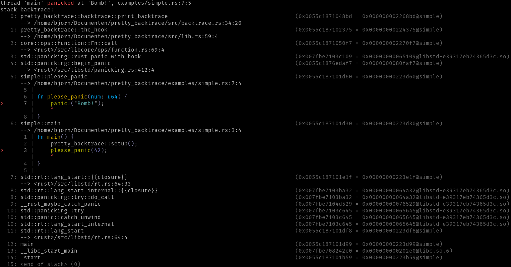

# Pretty backtraces for rust

[](https://crates.io/crates/pretty_backtrace)
[](https://travis-ci.com/bjorn3/pretty_backtrace)

```rust
pretty_backtrace::setup();
panic!("Bomb!");
```

Pretty backtraces are normally only enabled when `RUST_BACKTRACE=pretty` to prevent breaking tools
which parse printed backtraces. If you want to always enable pretty backtraces use `force_setup`.


